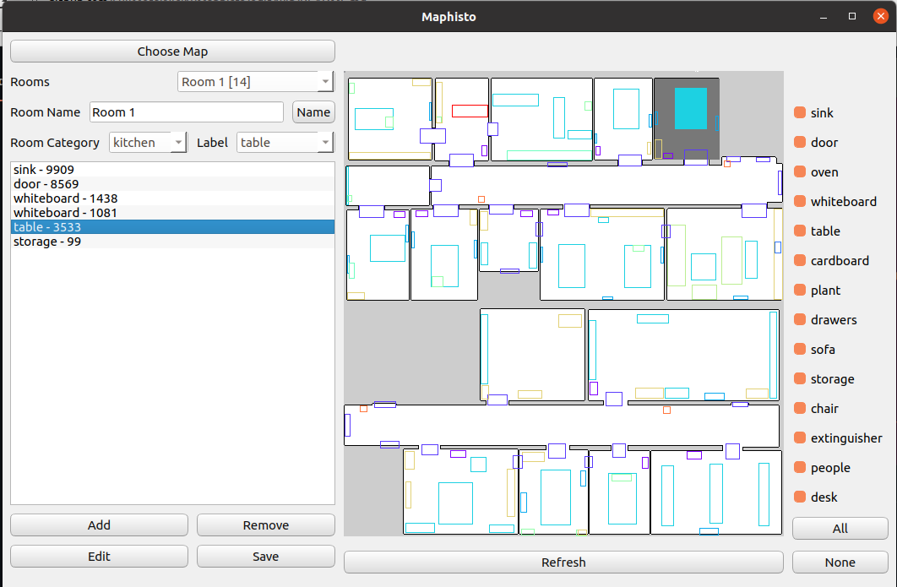

# MAPhisto - An Editor for Abstract Semantic Maps
User friendly editor for semantics enchanced robot localization.




Created by Nicky Zimmerman and [Lior Rozin](https://github.com/Zayatsoff).
## Installation

Required dependencies
```bash
pip install numpy matplotlib opencv-python 
```

## Usage

To use the editor, run 
```bash
python napp/Maphisto.py
```
[](https://www.youtube.com/watch?v=8c1wVnJntAo "MAPhisto")


