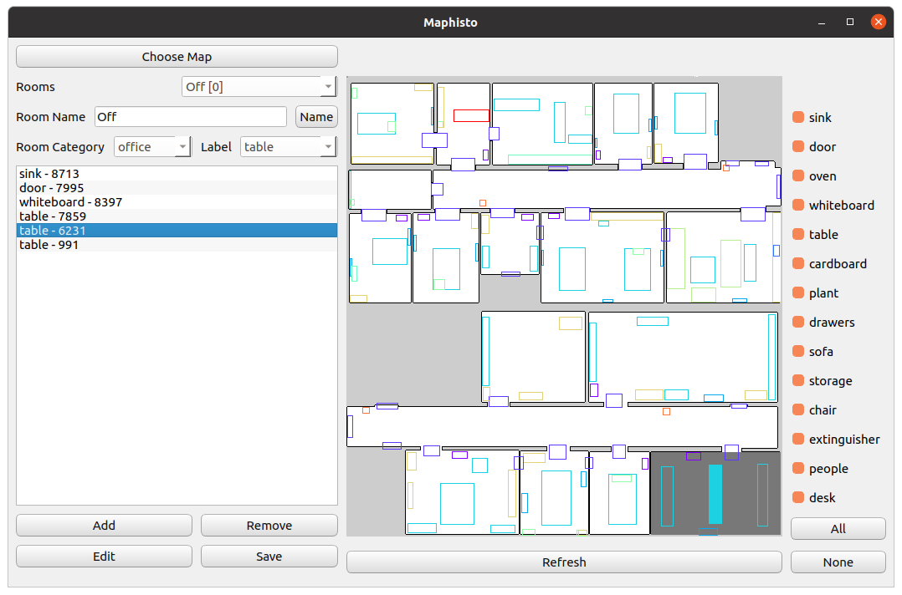

# MAPhisto - An Editor for Abstract Semantic Maps
User friendly editor for semantics enchanced robot localization.




## Installation

Required dependencies
```bash
pip install numpy matplotlib opencv-python 
```

## Usage

To use the editor, run 
```bash
python napp/Maphisto.py
```


